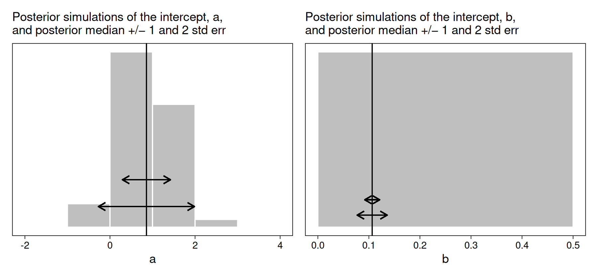
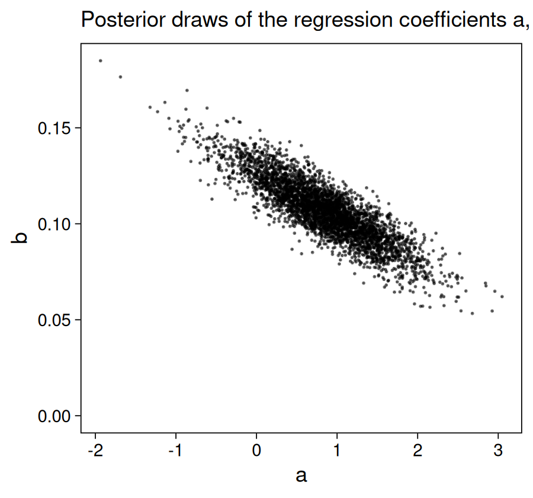
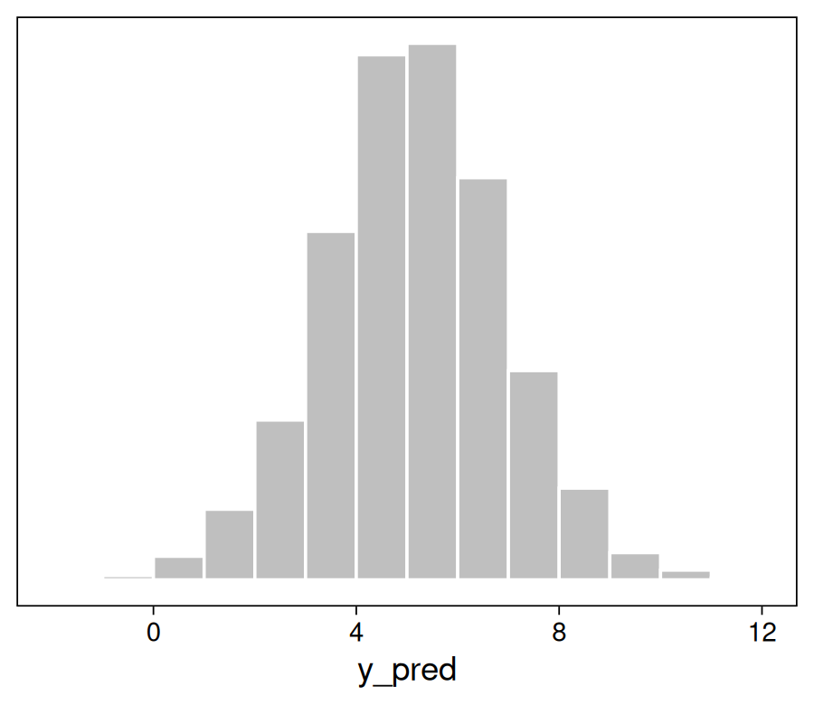

Adapted from [Aki Vehtari's code for ""Regression and other stories"](https://github.com/avehtari/ROS-Examples/) adapted by [Solomon Kurtz](https://github.com/ASKurz/Working-through-Regression-and-other-stories) for [brms](https://paulbuerkner.com/brms/) and the [tidyverse](https://www.tidyverse.org/).
https://solomonkurz.netlify.app/blog/2019-02-02-robust-linear-regression-with-student-s-t-distribution/


# Prediction and Bayesian inference

These notes adapt my tutorial on Bayesian inference with `rstanarm` for simple linear regression, with the example of lion nose markings predicting age, to `brms` with Solomon Kurtz' code as a starting point. 

Load the necessary packages, import the `LionNoses` data and transform the proportion variable to percentage, for ease of interpretation.


``` r
library(tidyverse)
library(abd)
library(brms)
library(broom.mixed)
library(posterior) # do I need this?
library(patchwork)

lion_noses <- as.data.frame(LionNoses) |> 
  mutate(percentage.black = 100*proportion.black)
skimr::skim(lion_noses)
```


Table: Data summary

|                         |           |
|:------------------------|:----------|
|Name                     |lion_noses |
|Number of rows           |32         |
|Number of columns        |3          |
|_______________________  |           |
|Column type frequency:   |           |
|numeric                  |3          |
|________________________ |           |
|Group variables          |None       |


**Variable type: numeric**

|skim_variable    | n_missing| complete_rate|  mean|    sd|   p0|   p25|   p50|   p75|  p100|hist  |
|:----------------|---------:|-------------:|-----:|-----:|----:|-----:|-----:|-----:|-----:|:-----|
|age              |         0|             1|  4.31|  2.68|  1.1|  2.18|  3.50|  5.85| 13.10|▇▃▃▁▁ |
|proportion.black |         0|             1|  0.32|  0.20|  0.1|  0.16|  0.26|  0.43|  0.79|▇▃▂▁▂ |
|percentage.black |         0|             1| 32.22| 19.86| 10.0| 16.50| 26.50| 43.25| 79.00|▇▃▂▁▂ |

The model is as for the rstanarm example, with age ~ intercept + error, wit Gaussian error. Jumping ahead, I'm going to also run a robust regression with `student` family replacing Gaussian, then put this later in the text. LATER ALSO ADD M1BRMS WIHT OUTLIERS/INFLUENTIAL POINTS REMOVED


``` r
methods(class = "brmsfit")
```

```
##  [1] add_criterion           add_ic                  as_draws_array          as_draws_df            
##  [5] as_draws_list           as_draws_matrix         as_draws_rvars          as_draws               
##  [9] as.array                as.data.frame           as.matrix               as.mcmc                
## [13] augment                 autocor                 bayes_factor            bayes_R2               
## [17] bridge_sampler          coef                    conditional_effects     conditional_smooths    
## [21] control_params          default_prior           expose_functions        family                 
## [25] fitted                  fixef                   formula                 getCall                
## [29] glance                  hypothesis              kfold                   log_lik                
## [33] log_posterior           logLik                  loo_compare             loo_linpred            
## [37] loo_model_weights       loo_moment_match        loo_predict             loo_predictive_interval
## [41] loo_R2                  loo_subsample           loo                     LOO                    
## [45] marginal_effects        marginal_smooths        mcmc_plot               model_weights          
## [49] model.frame             nchains                 ndraws                  neff_ratio             
## [53] ngrps                   niterations             nobs                    nsamples               
## [57] nuts_params             nvariables              pairs                   parnames               
## [61] plot                    post_prob               posterior_average       posterior_epred        
## [65] posterior_interval      posterior_linpred       posterior_predict       posterior_samples      
## [69] posterior_smooths       posterior_summary       pp_average              pp_check               
## [73] pp_mixture              predict                 predictive_error        predictive_interval    
## [77] prepare_predictions     print                   prior_draws             prior_summary          
## [81] psis                    ranef                   reloo                   residuals              
## [85] restructure             rhat                    sigma                   stancode               
## [89] standata                stanplot                summary                 tidy                   
## [93] update                  VarCorr                 variables               vcov                   
## [97] waic                    WAIC                   
## see '?methods' for accessing help and source code
```

``` r
m1brms <- brm(data = lion_noses,
      age ~ percentage.black,
      seed = 7,
      file = "models/m1brms")

m2brms <- update(m1brms,
                 family = "student",
                 file = "models/m2brms"
                 )
```

Here's the summary, using first `broom.mixed` then the default brms summary.


``` r
tidy(m1brms)
```

```
## # A tibble: 3 × 8
##   effect   component group    term             estimate std.error conf.low conf.high
##   <chr>    <chr>     <chr>    <chr>               <dbl>     <dbl>    <dbl>     <dbl>
## 1 fixed    cond      <NA>     (Intercept)         0.850    0.590   -0.345      1.99 
## 2 fixed    cond      <NA>     percentage.black    0.107    0.0158   0.0754     0.139
## 3 ran_pars cond      Residual sd__Observation     1.73     0.233    1.34       2.24
```

``` r
tidy(m2brms)
```

```
## # A tibble: 3 × 8
##   effect   component group    term             estimate std.error conf.low conf.high
##   <chr>    <chr>     <chr>    <chr>               <dbl>     <dbl>    <dbl>     <dbl>
## 1 fixed    cond      <NA>     (Intercept)         0.943    0.569   -0.179      2.06 
## 2 fixed    cond      <NA>     percentage.black    0.101    0.0164   0.0691     0.134
## 3 ran_pars cond      Residual sd__Observation     1.58     0.254    1.10       2.10
```

``` r
print(m1brms, robust = T, prob = 0.9)
```

```
##  Family: gaussian 
##   Links: mu = identity; sigma = identity 
## Formula: age ~ percentage.black 
##    Data: lion_noses (Number of observations: 32) 
##   Draws: 4 chains, each with iter = 2000; warmup = 1000; thin = 1;
##          total post-warmup draws = 4000
## 
## Regression Coefficients:
##                  Estimate Est.Error l-90% CI u-90% CI Rhat Bulk_ESS Tail_ESS
## Intercept            0.86      0.56    -0.12     1.81 1.00     3288     2780
## percentage.black     0.11      0.01     0.08     0.13 1.00     3314     2010
## 
## Further Distributional Parameters:
##       Estimate Est.Error l-90% CI u-90% CI Rhat Bulk_ESS Tail_ESS
## sigma     1.70      0.22     1.39     2.14 1.00     2992     2742
## 
## Draws were sampled using sampling(NUTS). For each parameter, Bulk_ESS
## and Tail_ESS are effective sample size measures, and Rhat is the potential
## scale reduction factor on split chains (at convergence, Rhat = 1).
```

``` r
print(m2brms, robust = T, prob = 0.9)
```

```
##  Family: student 
##   Links: mu = identity; sigma = identity; nu = identity 
## Formula: age ~ percentage.black 
##    Data: lion_noses (Number of observations: 32) 
##   Draws: 4 chains, each with iter = 2000; warmup = 1000; thin = 1;
##          total post-warmup draws = 4000
## 
## Regression Coefficients:
##                  Estimate Est.Error l-90% CI u-90% CI Rhat Bulk_ESS Tail_ESS
## Intercept            0.95      0.55     0.01     1.88 1.00     3764     2993
## percentage.black     0.10      0.02     0.07     0.13 1.00     3281     2796
## 
## Further Distributional Parameters:
##       Estimate Est.Error l-90% CI u-90% CI Rhat Bulk_ESS Tail_ESS
## sigma     1.57      0.24     1.17     2.01 1.00     2540     2299
## nu       16.04     11.45     4.12    46.56 1.00     2492     2194
## 
## Draws were sampled using sampling(NUTS). For each parameter, Bulk_ESS
## and Tail_ESS are effective sample size measures, and Rhat is the potential
## scale reduction factor on split chains (at convergence, Rhat = 1).
```
Continuing now just with m1brms

These summaries are derived from the posterior simulations, which you can access directly with `posterior_samples()`.


``` r
postpred <- as.data.frame(m1brms$fit)
dim(postpred)
```

```
## [1] 4000    6
```

``` r
head(postpred)
```

```
##   b_Intercept b_percentage.black    sigma Intercept    lprior      lp__
## 1  1.28404238         0.08958776 2.236083  4.170448 -3.661376 -66.77825
## 2  0.31204662         0.12182457 1.449798  4.237082 -3.410843 -64.92924
## 3  0.06676044         0.12934604 1.498576  4.234128 -3.424139 -65.43476
## 4  1.05441490         0.10277323 1.811902  4.365640 -3.542279 -64.13853
## 5  0.69610719         0.11336202 1.747696  4.348490 -3.518407 -64.01039
## 6  0.98364414         0.09966903 1.640560  4.194856 -3.460324 -63.91573
```

``` r
?as_draws
```

```
## Help on topic 'as_draws' was found in the following packages:
## 
##   Package               Library
##   posterior             /home/paul/R/x86_64-pc-linux-gnu-library/4.4
##   brms                  /home/paul/R/x86_64-pc-linux-gnu-library/4.4
```

We can hand-compute the median and mad sd for each using a **tidyverse**-style workflow like this.


``` r
postpred |> 
  pivot_longer(b_Intercept:sigma) |> 
  group_by(name) |>
  summarise(median = median(value),
            mad_sd = mad(value))
```

```
## # A tibble: 3 × 3
##   name               median mad_sd
##   <chr>               <dbl>  <dbl>
## 1 b_Intercept         0.857 0.564 
## 2 b_percentage.black  0.106 0.0147
## 3 sigma               1.70  0.217
```

### 9.1.1 Uncertainty in the regression coefficients and implied uncertainty in the regression line.

Before we make Figure 9.1, it'll be handy to save a few summary values.


``` r
med_a <- median(postpred$b_Intercept)
med_b <- median(postpred$b_percentage.black)

se_a <- fixef(m1brms, robust = T)[1, 2]
se_b <- fixef(m1brms, robust = T)[2, 2]
```

Now make the two subplots of Figure 9.1.


``` r
# set the global plotting theme
theme_set(theme_linedraw() +
            theme(panel.grid = element_blank()))

# left
p1 <-
  postpred %>% 
  ggplot(aes(x = b_Intercept)) +
  geom_histogram(binwidth = 1, boundary = 0, 
                 fill = "grey75", color = "white") +
  geom_vline(xintercept = med_a) +
  geom_segment(x = med_a - se_a, xend = med_a + se_a,
               y = 575, yend = 575,
               arrow = arrow(ends = "both", length = unit(0.25, "cm"))) +
  geom_segment(x = med_a - se_a * 2, xend = med_a + se_a * 2,
               y = 250, yend = 250,
               arrow = arrow(ends = "both", length = unit(0.25, "cm"))) +
  scale_y_continuous(NULL, breaks = NULL) +
  labs(subtitle = "Posterior simulations of the intercept, a,\nand posterior median +/− 1 and 2 std err",
       x = "a")

# right
p2 <-
  postpred %>% 
  ggplot(aes(x = b_percentage.black)) +
  geom_histogram(binwidth = 0.5, boundary = 0, 
                 fill = "grey75", color = "white") +
  geom_vline(xintercept = med_b) +
  geom_segment(x = med_b - se_b, xend = med_b + se_b,
               y = 625, yend = 625,
               arrow = arrow(ends = "both", length = unit(0.25, "cm"))) +
  geom_segment(x = med_b - se_b * 2, xend = med_b + se_b * 2,
               y = 275, yend = 275,
               arrow = arrow(ends = "both", length = unit(0.25, "cm"))) +
  scale_y_continuous(NULL, breaks = NULL) +
  labs(subtitle = "Posterior simulations of the intercept, b,\nand posterior median +/− 1 and 2 std err",
       x = "b")
```

Bind the two subplots together with **patchwork** syntax and plot.


``` r
p1 + p2
```



The scatter plot of Figure 9.2 is pretty simple.


``` r
p1 <-
  postpred %>% 
  ggplot(aes(x = b_Intercept, y = b_percentage.black)) +
  geom_point(size = 1/6, alpha = 1/2) +
  labs(subtitle = "Posterior draws of the regression coefficients a, b",
       x = "a",
       y = "b") +
  ylim(0, NA)

p1
```



The spaghetti plot in Figure 9.2b is a little more involved. Here we make it and then combine the two ggplots to make the complete Figure 9.2.


``` r
set.seed(9)


p2 <-
  postpred |> 
  slice_sample(n = 100) |> 
  ggplot() +
  geom_abline(aes(intercept = b_Intercept, slope = b_percentage.black),
              size = 1/4, alpha = 1/2, color = "grey33") +
  geom_point(data = lion_noses,
             aes(x = percentage.black, y = age)) +
  scale_x_continuous("Age (years)",
                     breaks = 0:4, labels = function(x) str_c(x, "%"),
                     limits = c(-1, 5), expand = c(0, 0)) +
  scale_y_continuous("Percentage black markings on nose",
                     labels = function(x) str_c(x, "%")) +
  coord_cartesian(ylim = c(43, 62)) +
  labs(subtitle = "Data and 100 posterior draws of the line, y = a + bx",
       x = "x",
       y = "y")

# combine
(p1 + p2) &
  theme(plot.subtitle = element_text(size = 10),
        plot.title.position = "plot")
```


### 9.1.2 Using the matrix of posterior simulations to express uncertainty about a parameter estimate or function of parameter estimates.

Here's a **tidyverse** way to compute the central tendency (median) and spread (mad sd) for a combination of parameters.


``` r
postpred %>% 
  mutate(z = b_Intercept / b_percentage.black) %>% 
  summarise(median = median(z),
            mad_sd = mad(z))
```

```
##     median   mad_sd
## 1 8.087385 6.241189
```

## 9.2 Prediction and uncertainty: `predict`, `posterior_linpred`, and `posterior_predict`

The **brms** package also includes the `predict()`, `posterior_linpred()`, and `posterior_predict()` functions. On page 115, we learn these will alow us to

* compute "the best point estimate of the average value of $y$ for new data points," $\hat a + \hat b x^\text{new}$;
* compute "the distribution of uncertainty about the expected or average value of $y$ for new data points," $a + b x^\text{new}$ ; and
* compute the "uncertainty about a new observation $y$ with predictors $x^\text{new}$," $a + b x^\text{new} + \text{error}$.

```r
# something like this - adapt
new_grid <- data.frame(percentage.black=seq(10,80,5))
y_point_pred_grid <- predict(m1brms, newdata=new_grid)
y_linpred_grid <- posterior_linpred(M1, newdata=new_grid)
y_pred_grid <- posterior_predict(M1, newdata=new_grid)
```

### 9.2.1 Point prediction using predict.

Say we want to use our `m7.1` to predict an incumbent's vote percentage, conditional on 2% economic growth. If we would like a simple point prediction, we can use `brms::predict()`. A key point is we'll need to feed in our `growth` value by way of a data frame or tibble, which we'll call `new`. The `new` data is then fed into the `newdata` argument. If we want the point summarized by a posterior median, rather than a posterior mean, we need to set `robust = TRUE`.


``` r
new <- tibble(percentage.black = 40)

predict(m1brms, 
        newdata = new,
        robust = T)
```

```
##      Estimate Est.Error     Q2.5    Q97.5
## [1,] 5.116354  1.724652 1.619278 8.678755
```

As is typical, **brms** accompanies the point `Estimate` with measures of spread. If we wanted to use the posterior medians of the `a` and `b` parameters to do this by hand, it will probably be easiest to extract these using `fixef()`.


``` r
a_hat <- fixef(m1brms, robust = T)[1, 1]
b_hat <- fixef(m1brms, robust = T)[2, 1]

a_hat + b_hat * new
```

```
##   percentage.black
## 1         5.115686
```

This method, however, gives a point estimate without any measures of spread.

### 9.2.2 Linear predictor with uncertainty using `posterior_linpred` or `posterior_epred`.

Much like in the text, the `brms::posterior_linpred()` function returns a vector of posterior draws.


``` r
y_linpred <-
  posterior_linpred(m1brms, 
                    newdata = new,
                    robust = T)
?posterior_linpred
```

```
## Help on topic 'posterior_linpred' was found in the following packages:
## 
##   Package               Library
##   rstantools            /home/paul/R/x86_64-pc-linux-gnu-library/4.4
##   brms                  /home/paul/R/x86_64-pc-linux-gnu-library/4.4
```

``` r
str(y_linpred)
```

```
##  num [1:4000, 1] 4.87 5.19 5.24 5.17 5.23 ...
```

We can get these by hand by working directly with `post`.


``` r
postpred |> 
  mutate(percentage.black = 40) |> 
  mutate(y_linpred = b_Intercept + b_percentage.black * percentage.black) |> 
  select(y_linpred) |>
  head()
```

```
##   y_linpred
## 1  4.867553
## 2  5.185030
## 3  5.240602
## 4  5.165344
## 5  5.230588
## 6  4.970406
```

Happily for y'all **tidyverse** fans, this method returns a tibble.

### 9.2.3 Predictive distribution for a new observation using `posterior_predict`.

The `brms::posterior_predict()` function works very much like the `posterior_linpred()`, from last section.


``` r
y_pred <-
  posterior_predict(m1brms, 
                    newdata = new,
                    robust = T)

str(y_pred)
```

```
##  num [1:4000, 1] 5.08 5.32 7.98 1.96 6.24 ...
##  - attr(*, "dimnames")=List of 2
##   ..$ : NULL
##   ..$ : NULL
```

You can do this by hand, to, by working directly with `post`.


``` r
postpred |> 
  mutate(percentage.black = 40) |> 
  mutate(y_pred = rnorm(n(), mean = b_Intercept + b_percentage.black * percentage.black, sd = sigma)) |> 
  select(y_pred) |> 
  head()
```

```
##     y_pred
## 1 6.608585
## 2 4.743617
## 3 3.835837
## 4 5.772161
## 5 3.514972
## 6 7.714412
```

Either way, we can now visualize the uncertainty in `y_pred` using a histogram. Here we'll do that with the results from the `posterior_predict()` method.


``` r
tibble(y_pred = y_pred) %>% 
  ggplot(aes(x = y_pred)) +
  geom_histogram(binwidth = 1, boundary = 0, 
                 fill = "grey75", color = "white") +
  scale_y_continuous(NULL, breaks = NULL)
```



Here's a numeric breakdown.


``` r
tibble(y_pred = y_pred) |> 
  summarise(median = median(y_pred),
            mad_sd = mad(y_pred),
            age_prob = mean(y_pred < 4))
```

```
## # A tibble: 1 × 3
##   median mad_sd age_prob
##    <dbl>  <dbl>    <dbl>
## 1   5.13   1.70    0.252
```

### 9.2.4 Prediction given a range of input values.

We can use these three functions to evaluate the posterior predictions for a range of predictor values. First we define a range of `growth` values.


``` r
new_grid <- tibble(percentage.black = seq(from = 10, to = 80, by = 5))

glimpse(new_grid)
```

```
## Rows: 15
## Columns: 1
## $ percentage.black <dbl> 10, 15, 20, 25, 30, 35, 40, 45, 50, 55, 60, 65, 70, 75, 80
```

Now plug those into our post-processing functions.


``` r
y_point_pred_grid <- 
  predict(m1brms, 
          newdata = new_grid,
          robust = T) 

y_linpred_grid <- 
  posterior_linpred(m1brms, 
                    newdata = new_grid,
                    robust = T) 

y_pred_grid <- 
  posterior_predict(m1brms, 
                    newdata = new_grid,
                    robust = T)
```

Use the `str()` function to inspect what we've done.


``` r
str(y_point_pred_grid)
```

```
##  num [1:15, 1:4] 1.87 2.49 3 3.53 4.04 ...
##  - attr(*, "dimnames")=List of 2
##   ..$ : NULL
##   ..$ : chr [1:4] "Estimate" "Est.Error" "Q2.5" "Q97.5"
```

``` r
str(y_linpred_grid)
```

```
##  num [1:4000, 1:15] 2.18 1.53 1.36 2.08 1.83 ...
```

``` r
str(y_pred_grid)
```

```
##  num [1:4000, 1:15] 7.016 2.92 0.148 0.308 1.248 ...
##  - attr(*, "dimnames")=List of 2
##   ..$ : NULL
##   ..$ : NULL
```

The first function, `brms::predict()`, returned a $13 \times 4$ numeric array where the rows indexed each of the 13 `growth` values and the columns are the typical **brms** summary statistics: `Estimate`, `Est.Error`, `Q2.5`, and `Q97.5`. Both `posterior_linpred()` and `posterior_predict()` returned $4{,}000 \times 13$ numeric arrays where the columns marks off the 13 values of `growth` and the rows index the 4,000 posterior draws for each.

### 9.2.5 Propagating uncertainty.

If we want to propagate uncertainty in our predictor, too, it's probably easiest to do with by working with `post` itself. Here we express that uncertainty as $\text{growth} \sim \operatorname{Normal}(2, 0.3)$. CHECK THIS, SILLY ANSWER FOR ME!!


``` r
postpred |> 
  # make the uncertain predictor
  mutate(percentage.black = rnorm(n(), mean = 40.0, sd = 0.5)) |> 
  # predict
  mutate(y_pred = rnorm(n(), mean = b_Intercept + b_percentage.black *
                               percentage.black, sd = sigma)) |> 
  # now summarize
  summarise(median = median(y_pred),
            mad_sd = mad(y_pred),
            age_prob = mean(y_pred <40))
```

```
##     median   mad_sd age_prob
## 1 5.186938 1.744543        1
```

### 9.2.6 Simulating uncertainty for the linear predictor and new observations.

Load the `earnings.csv` data.


``` r
earnings <- read_csv("earnings.csv")

glimpse(earnings)
```

```
## Rows: 1,816
## Columns: 15
## $ height           <dbl> 74, 66, 64, 65, 63, 68, 63, 64, 62, 73, 72, 72, 72, 70, 63, 68, 68, 71, 6…
## $ weight           <dbl> 210, 125, 126, 200, 110, 165, 190, 125, 200, 230, 176, 265, 160, 225, 107…
## $ male             <dbl> 1, 0, 0, 0, 0, 0, 0, 0, 0, 1, 1, 1, 1, 1, 0, 1, 1, 1, 0, 0, 0, 0, 0, 0, 1…
## $ earn             <dbl> 50000, 60000, 30000, 25000, 50000, 62000, 51000, 9000, 29000, 32000, 2000…
## $ earnk            <dbl> 50.00, 60.00, 30.00, 25.00, 50.00, 62.00, 51.00, 9.00, 29.00, 32.00, 2.00…
## $ ethnicity        <chr> "White", "White", "White", "White", "Other", "Black", "White", "White", "…
## $ education        <dbl> 16, 16, 16, 17, 16, 18, 17, 15, 12, 17, 15, NA, 12, 16, 14, 11, 12, 18, 1…
## $ mother_education <dbl> 16, 16, 16, 17, 16, 18, 17, 15, 12, 17, 15, 99, 12, 16, 14, NA, 12, 18, 1…
## $ father_education <dbl> 16, 16, 16, NA, 16, 18, 17, 15, 12, 17, 15, 99, 12, NA, 14, NA, 12, 18, 1…
## $ walk             <dbl> 3, 6, 8, 8, 5, 1, 3, 7, 2, 7, 8, 1, 1, 4, 7, 7, 6, 4, 5, 8, 4, 1, 5, 5, 7…
## $ exercise         <dbl> 3, 5, 1, 1, 6, 1, 1, 4, 2, 1, 1, 1, 2, 1, 4, 4, 5, 6, 1, 1, 2, 4, 1, 4, 4…
## $ smokenow         <dbl> 2, 1, 2, 2, 2, 2, 2, 1, 2, 1, 2, 2, 2, 2, 2, 2, 2, 2, 2, 1, 1, 1, 2, 2, 2…
## $ tense            <dbl> 0, 0, 1, 0, 0, 2, 4, 4, 0, 0, 0, 0, 1, 0, 2, 0, 2, 0, 1, 0, 7, 0, 1, 1, 0…
## $ angry            <dbl> 0, 0, 1, 0, 0, 2, 4, 4, 0, 0, 0, 0, 1, 0, 2, 0, 2, 0, 1, 0, 7, 0, 1, 1, 0…
## $ age              <dbl> 45, 58, 29, 57, 91, 54, 39, 26, 49, 46, 21, 53, 26, 65, 50, 34, 27, 51, 5…
```

Use `brm()` to fit the model, $\text{weight}_i = a + b \text{height}_i + e_i$, using default weak priors.


``` r
m9.1 <-
  brm(data = earnings,
      weight ~ height,
      seed = 9,
      file = "models/m09.01")
```

Check the summary.


``` r
print(m9.1, robust = T)
```

```
##  Family: gaussian 
##   Links: mu = identity; sigma = identity 
## Formula: weight ~ height 
##    Data: earnings (Number of observations: 1789) 
##   Draws: 4 chains, each with iter = 2000; warmup = 1000; thin = 1;
##          total post-warmup draws = 4000
## 
## Regression Coefficients:
##           Estimate Est.Error l-95% CI u-95% CI Rhat Bulk_ESS Tail_ESS
## Intercept  -173.20     11.62  -195.96  -150.36 1.00     3502     2795
## height        4.95      0.17     4.61     5.29 1.00     3475     2814
## 
## Further Distributional Parameters:
##       Estimate Est.Error l-95% CI u-95% CI Rhat Bulk_ESS Tail_ESS
## sigma    28.96      0.49    28.03    29.90 1.00     5158     3013
## 
## Draws were sampled using sampling(NUTS). For each parameter, Bulk_ESS
## and Tail_ESS are effective sample size measures, and Rhat is the potential
## scale reduction factor on split chains (at convergence, Rhat = 1).
```

Since the intercept is difficult to interpret with this parameterization, we might center the predictor.


``` r
earnings <-
  earnings %>% 
  mutate(c_height = height - 66)
```

Now fit the model, $\text{weight}_i = a + b (\text{height}_i - 66) + e_i$.


``` r
m9.2 <-
  brm(data = earnings,
      weight ~ c_height,
      seed = 9,
      file = "models/m09.02")
```


``` r
print(m9.2, robust = T)
```

```
##  Family: gaussian 
##   Links: mu = identity; sigma = identity 
## Formula: weight ~ c_height 
##    Data: earnings (Number of observations: 1789) 
##   Draws: 4 chains, each with iter = 2000; warmup = 1000; thin = 1;
##          total post-warmup draws = 4000
## 
## Regression Coefficients:
##           Estimate Est.Error l-95% CI u-95% CI Rhat Bulk_ESS Tail_ESS
## Intercept   153.37      0.70   152.01   154.80 1.00     3979     3018
## c_height      4.95      0.18     4.59     5.30 1.00     4162     3163
## 
## Further Distributional Parameters:
##       Estimate Est.Error l-95% CI u-95% CI Rhat Bulk_ESS Tail_ESS
## sigma    28.95      0.47    28.03    29.94 1.00     4421     3064
## 
## Draws were sampled using sampling(NUTS). For each parameter, Bulk_ESS
## and Tail_ESS are effective sample size measures, and Rhat is the potential
## scale reduction factor on split chains (at convergence, Rhat = 1).
```

The intercept, 153.4, is the expected `weight` value when `height == 66`. If we'd like a simple point prediction for `weight` when `c_height == 4`, we might use `brms::predict()`.


``` r
new <- tibble(c_height = 4.0)

predict(m9.2, 
        newdata = new,
        robust = T)[1]
```

```
## [1] 173.8007
```

If we'd like simulated draws for the linear predictor, we might use `brms::posterior_linpred()`.


``` r
posterior_linpred(m9.2, 
                  newdata = new,
                  robust = T) %>% 
  head()
```

```
##          [,1]
## [1,] 171.6062
## [2,] 174.7377
## [3,] 174.2553
## [4,] 170.3336
## [5,] 172.5709
## [6,] 172.6137
```

If we want a full posterior predictive distribution for new persons of `c_weight == 4`, we'd then use `posterior_predict()`.


``` r
posterior_predict(m9.2, 
                  newdata = new,
                  robust = T) %>% 
  head()
```

```
##          [,1]
## [1,] 175.7039
## [2,] 156.0523
## [3,] 158.0455
## [4,] 160.3399
## [5,] 206.5949
## [6,] 178.3422
```

